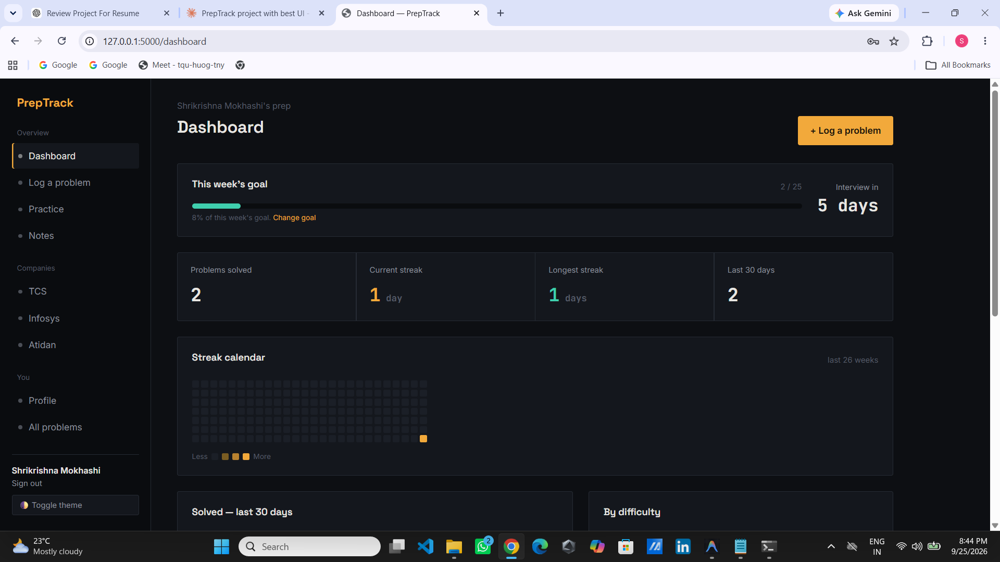
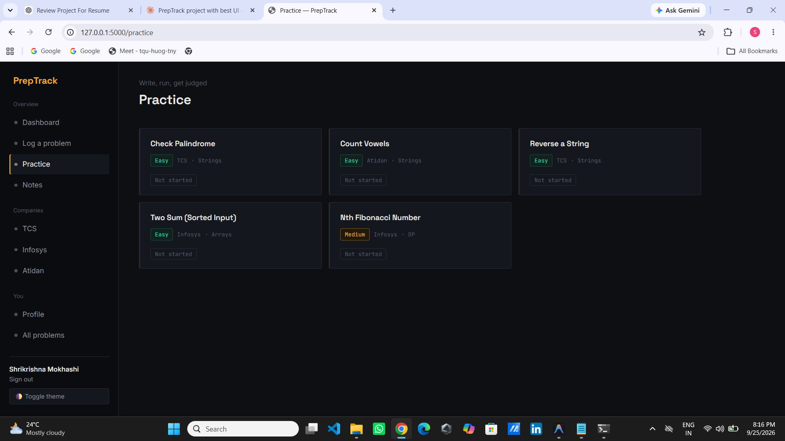
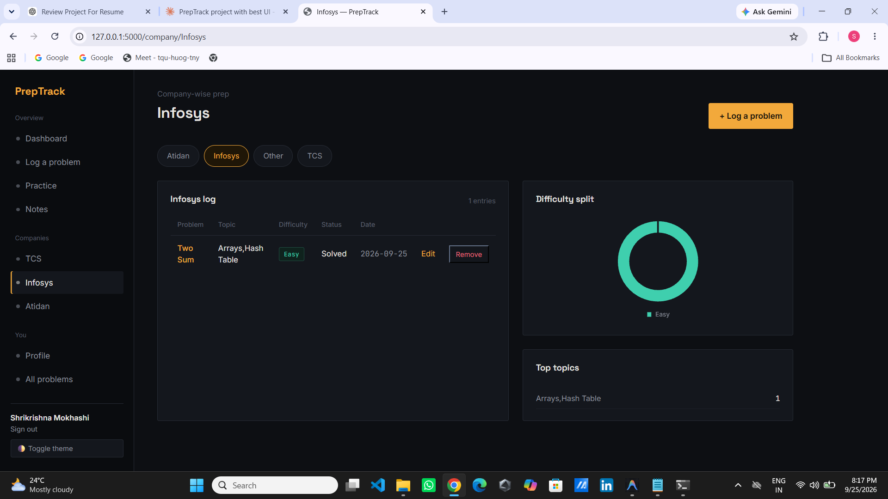
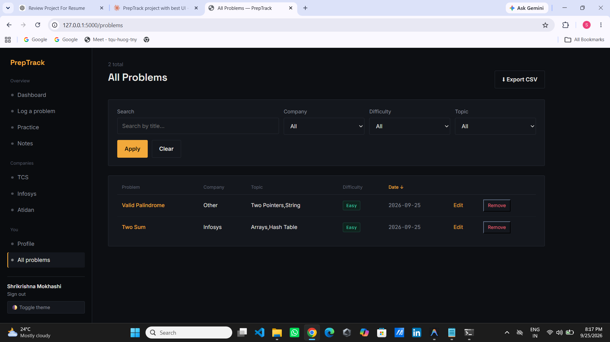
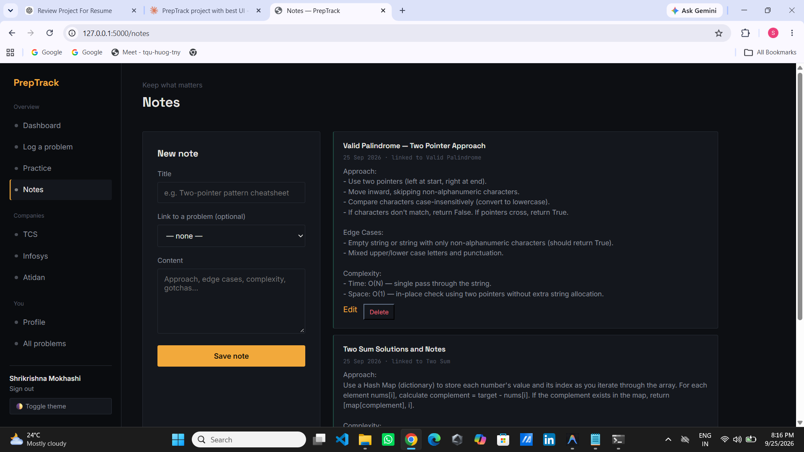
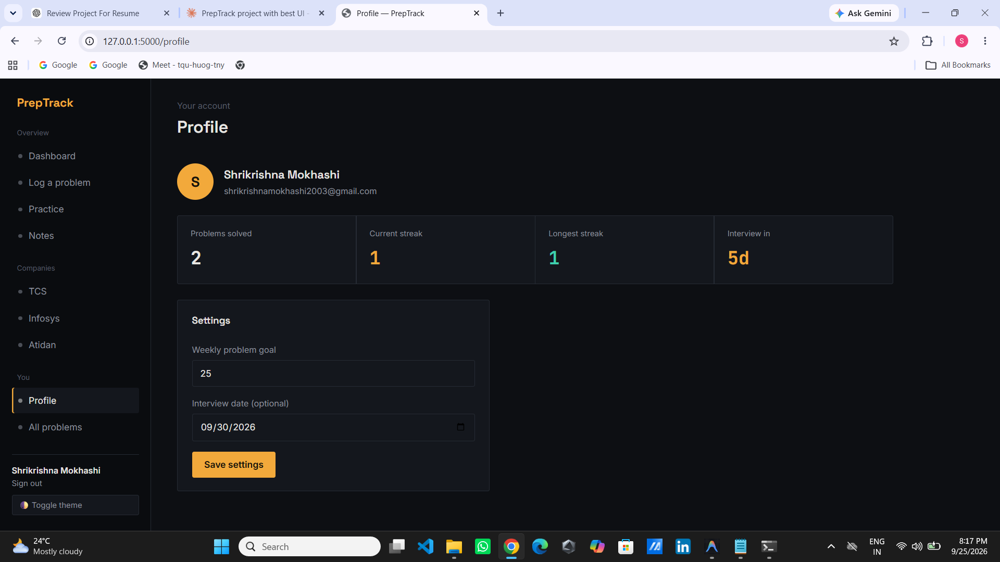
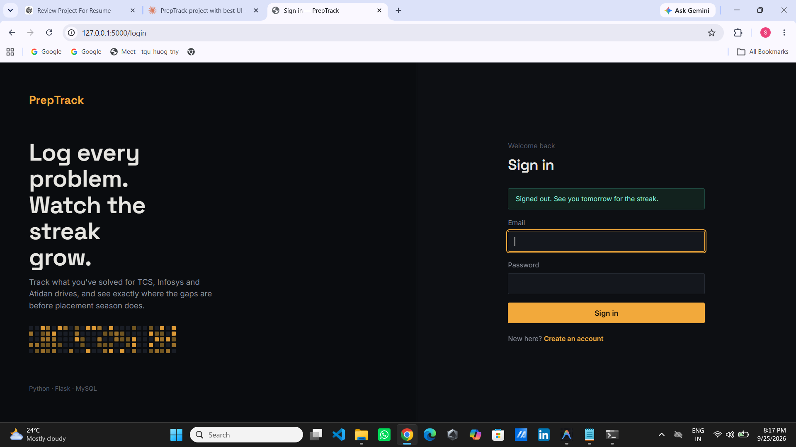
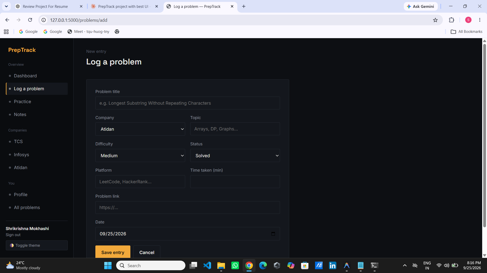

# 🚀 PrepTrack

<p align="center">
  <a href="https://exquisite-friendship.up.railway.app">
    
  </a>

  <a href="https://github.com/Shrikrishna2003/PrepTrack">
    
  </a>

  
  
</p>

<p align="center">
  <b>Full-Stack Coding Interview Preparation Platform</b><br>
  Track coding progress, build streaks, practice interview problems, and analyze preparation with an interactive dashboard.
</p>

PrepTrack is a full-stack coding interview preparation platform built with Flask and MySQL that helps students track coding progress, maintain streaks, practice interview problems, and visualize preparation through an interactive analytics dashboard.

---

## ✨ Features

- **Auth** — register, login, and logout with hashed passwords (Werkzeug)
- **Problem Log** — add, edit, and delete coding problems with company, topic, difficulty, platform, link, status, date, and time taken
- **Search, Filter & Sort** — quickly find problems with search-by-title, company, difficulty, and topic filters
- **Company Analytics** — view company-wise preparation with difficulty breakdowns and top topics
- **Practice & Code Judge** — solve Python problems in an in-browser editor and receive automatic grading against test cases
- **Progress Dashboard** — visualize a 30-day trend, difficulty distribution, and company-wise progress using Chart.js
- **Daily Streak** — maintain current and longest streaks with a GitHub-style contribution heatmap
- **Weekly Goals** — set weekly targets and track progress with a live dashboard progress bar
- **Interview Countdown** — set a target interview date and see remaining days on the dashboard and profile
- **Profile Management** — manage personal information, goals, and interview settings
- **Notes** — create and edit personal notes, optionally linked to specific problems
- **CSV Export** — export the complete problem log for further analysis
- **Dark/Light Mode** — theme preference persists using localStorage
- **Cloud Deployment** — deployed on **Railway** with automatic **GitHub CI/CD** deployments
- **Logging** — all user actions (register, login, add/edit/delete, submissions) are logged to the console and `preptrack.log`

---

## 🛠 Tech Stack

<p align="center">
  
</p>

<p align="center">
  
  
  
</p>

---

## 🏗 Architecture

```text
Browser
   │
   ▼
Flask (Gunicorn)
   │
   ├── Authentication
   ├── Dashboard
   ├── Notes
   ├── Practice Judge
   └── Analytics API
   │
   ▼
Railway MySQL
```

---

## 📂 Project Structure

```text
PrepTrack/
├── app.py                  # Routes, authentication, dashboard, APIs
├── config.py               # Environment-based configuration
├── schema.sql              # MySQL schema + seed companies
├── feature_schema.sql      # Database migration for new features
├── practice_schema.sql     # Practice module schema
├── judge.py                # Python code execution & judging
├── requirements.txt
├── .env.example
├── templates/
│   ├── base.html
│   ├── login.html
│   ├── register.html
│   ├── dashboard.html
│   ├── company.html
│   ├── add_problem.html
│   └── notes.html
└── static/
    ├── css/style.css
    └── js/
        ├── charts.js
        └── company_chart.js
```

---

## 📸 Screenshots

| Dashboard | Practice |
|-----------|----------|
|  |  |

| Company Analytics | All Problems |
|-------------------|--------------|
|  |  |

| Notes | Profile |
|--------|---------|
|  |  |

| Login | Log a Problem |
|--------|---------------|
|  |  |

---

## 🌐 Live Demo

🔗 **Website:** `https://exquisite-friendship.up.railway.app`

### Demo Access

- Register a new account
- Or log in using your own account

> Hosted on Railway with MySQL and automatic GitHub deployments.

---

## 🚀 Setup

### 1. Create the database

```bash
mysql -u root -p < schema.sql
```

If you already have an existing PrepTrack database, run the migration files instead:

```bash
mysql -u root -p preptrack < feature_schema.sql
mysql -u root -p preptrack < practice_schema.sql
```

### 2. Install dependencies

```bash
python -m venv venv

# Windows
venv\Scripts\activate

# Linux/macOS
source venv/bin/activate

pip install -r requirements.txt
```

### 3. Configure environment variables

Copy `.env.example` to `.env`.

```bash
cp .env.example .env
```

Fill in your MySQL credentials.

If using `python-dotenv`, add:

```python
from dotenv import load_dotenv
load_dotenv()
```

near the top of `app.py`.

### 4. Run the application

```bash
python app.py
```

Open:

```text
http://127.0.0.1:5000
```

Register an account and start tracking your coding preparation.

---

## 🎨 Design Philosophy

PrepTrack uses a terminal-inspired UI with a dark theme, monospace statistics, and a GitHub-style contribution heatmap instead of a generic dashboard. Color coding remains consistent across the application:

- 🟨 Amber — streaks and in-progress work
- 🟩 Teal — completed work and easy problems
- 🌹 Rose — hard problems

This makes progress easy to understand at a glance.

---

## 💻 Practice & Judge

- Problems are stored in `practice_problems` and `practice_test_cases`.
- CodeMirror provides an in-browser coding experience without external CDNs.
- `/api/practice/<id>/run` executes sample runs.
- `/api/practice/<id>/submit` grades submissions against all test cases.
- `judge.py` executes Python code with a **5-second timeout**.

### Security Note

The current implementation is intended for personal practice and is **not a production sandbox**. For multi-user deployments, use isolated execution such as Docker containers, gVisor, seccomp, or Judge0.

---

## 🚀 Future Improvements

- Password reset
- Email verification
- Multi-language code execution
- Admin/teacher dashboard
- Batch-wise leaderboard
- PDF export
- Enhanced analytics
